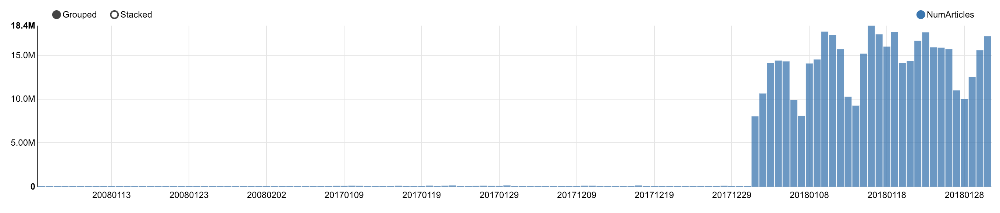

Contributors : Raphael Lederman, Anatoli De Bradke, Alexandre Bec, Anthony Houdaille, Thomas Binetruy

# GDELT : A Cassandra resilient architecture

The GDELT Project monitors the world's broadcast, print, and web news from nearly every corner of every country in over 100 languages and identifies the people, locations, organizations, themes, sources, emotions, counts, quotes, images and events driving our global society every second of every day, creating a free open platform for computing on the entire world. With new files uploaded every 15 minutes, GDELT data bases contain more than 500 Gb of zipped data for the single year 2018.

In order to be able to work with a large amount of data, we have chosen to work with the following architecture :
- NoSQL : Cassandra
- AWS : EMR to transfer the data to Cassandra, and EC2 for the resiliency for the requests
- Visualization : A Zeppelin Notebook

## 1. The data

Description of the data Mentions and Events : http://data.gdeltproject.org/documentation/GDELT-Event_Codebook-V2.0.pdf
Description of the Graph of Events GKG : http://data.gdeltproject.org/documentation/GDELT-Global_Knowledge_Graph_Codebook-V2.1.pdf


A event is defined as an action that an actor (Actor1) takes on another actor (Actor2). A mention is an article or any source that talks about an event. The GKG database reflects the events that took place in the world, ordered by theme, type of event and location.

The conceptual model of the data is the following :


## 2. Architecture

The architecture we have chosen is the following :


## 3. Data Preparation

The ZIP files are extracted from the GDELT website :
``` scala
def fileDownloader(urlOfFileToDownload: String, fileName: String) = {
    val url = new URL(urlOfFileToDownload)
    val connection = url.openConnection().asInstanceOf[HttpURLConnection]
    connection.setConnectTimeout(5000)
    connection.setReadTimeout(5000)
    connection.connect()

    if (connection.getResponseCode >= 400)
        println("error")
    else
        url #> new File(fileName) !!
}

fileDownloader("http://data.gdeltproject.org/gdeltv2/masterfilelist.txt", "/tmp/masterfilelist.txt") // save the list file to the Spark Master
fileDownloader("http://data.gdeltproject.org/gdeltv2/masterfilelist-translation.txt", "/tmp/masterfilelist_translation.txt") //same for Translation file

awsClient.putObject("fabien-mael-telecom-gdelt2018", "masterfilelist.txt", new File("/tmp/masterfilelist.txt") )
awsClient.putObject("fabien-mael-telecom-gdelt2018", "masterfilelist_translation.txt", new File( "/tmp/masterfilelist_translation.txt") )

val list_csv = spark.read.format("csv").option("delimiter", " ").
                    csv("s3a://fabien-mael-telecom-gdelt2018/masterfilelist.txt").
                    withColumnRenamed("_c0","size").
                    withColumnRenamed("_c1","hash").
                    withColumnRenamed("_c2","url")
val list_2018_tot = list_csv.where(col("url").like("%/2018%"))
list_2018_tot.select("url").repartition(100).foreach( r=> {
            val URL = r.getAs[String](0)
            val fileName = r.getAs[String](0).split("/").last
            val dir = "/mnt/tmp/"
            val localFileName = dir + fileName
            fileDownloader(URL,  localFileName)
            val localFile = new File(localFileName)
            AwsClient.s3.putObject("fabien-mael-telecom-gdelt2018", fileName, localFile )
            localFile.delete()
})

```
We duplicate this task for the translation data. Then, we need to create four data frames : 
- Mentions in english
- Events in english
- Mentions translated
- Events translated

This is done the following way :
```
val mentionsRDD_trans = sc.binaryFiles("s3a://fabien-mael-telecom-gdelt2018/201801*translation.mentions.CSV.zip"). // charger quelques fichers via une regex
   flatMap {  // decompresser les fichiers
       case (name: String, content: PortableDataStream) =>
          val zis = new ZipInputStream(content.open)
          Stream.continually(zis.getNextEntry).
                takeWhile{ case null => zis.close(); false
                       case _ => true }.
                flatMap { _ =>
                    val br = new BufferedReader(new InputStreamReader(zis))
                    Stream.continually(br.readLine()).takeWhile(_ != null)
                }
    }
val mentionsDF_trans = mentionsRDD_trans.map(x => x.split("\t")).map(row => row.mkString(";")).map(x => x.split(";")).toDF()
```

In order to reach fast responding queries, we create several smaller data frames for the different queries we later on build. For example :
```
// Mentions
val mentions_trans_1 = mentionsDF_trans.withColumn("_tmp", $"value").select(
    $"_tmp".getItem(0).as("globaleventid"),
    $"_tmp".getItem(14).as("language")
    )
val mentions_1 = mentionsDF.withColumn("_tmp", $"value").select(
    $"_tmp".getItem(0).as("globaleventid"),
    $"_tmp".getItem(14).as("language")
    )
    
// Events 
val events_trans_1 = exportDF_trans.withColumn("_tmp", $"value").select(
    $"_tmp".getItem(0).as("globaleventid"),
    $"_tmp".getItem(1).as("day"),
    $"_tmp".getItem(33).as("numarticles"),
    $"_tmp".getItem(53).as("actioncountry")
    )
val events_1 = exportDF.withColumn("_tmp", $"value").select(
    $"_tmp".getItem(0).as("globaleventid"),
    $"_tmp".getItem(1).as("day"),
    $"_tmp".getItem(33).as("numarticles"),
    $"_tmp".getItem(53).as("actioncountry")
    )
    
val df_events_1 = events_1.union(events_trans_1)
val df_mentions_1 = mentions_1.union(mentions_trans_1)

// Join events and mentions
val df_1 = df_mentions_1.join(df_events_1,"GlobalEventID")
```

We can later on build the Cassandra tables that will allow us transfer the spark dataframes :
```
%cassandra
CREATE TABLE q1_1(
day int,
language text,
actioncountry text,
numarticles int,
PRIMARY KEY (day, language, actioncountry));
```

Finally, we can write the dataframe to Cassandra. Therefore, the lazy evaluation will take place before we add requests to the data base.
```
df_1.write.cassandraFormat("q1_1", "gdelt_datas").save()
val df_1_1 = spark.read.cassandraFormat("q1_1", "gdelt_datas").load()
df_1_1.createOrReplaceTempView("q1_1")
```

The requests are then simple to make :
```z.show(spark.sql(""" SELECT * FROM q1_1 ORDER BY NumArticles DESC LIMIT 10 """))```



## 4. Budget

One should take into account the budget of implementing such structure. The costs for our project was the following :
- S3 storage and EMR to load the data in Cassandra : 50$
- EC2 instances : 40$

## 5. Potential improvements

Some recent projects on the GDELT Project include :
- a streaming architecture updating the data every 15 minutes
- a web interface using CartoDB
- ...


